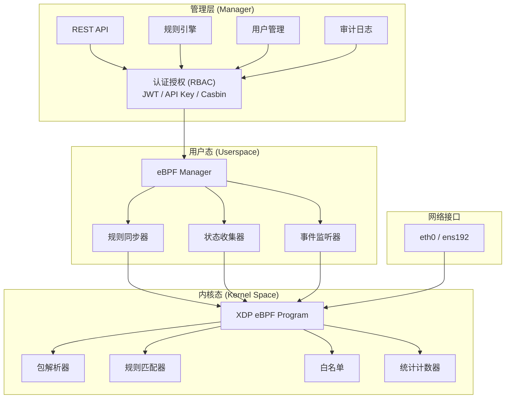
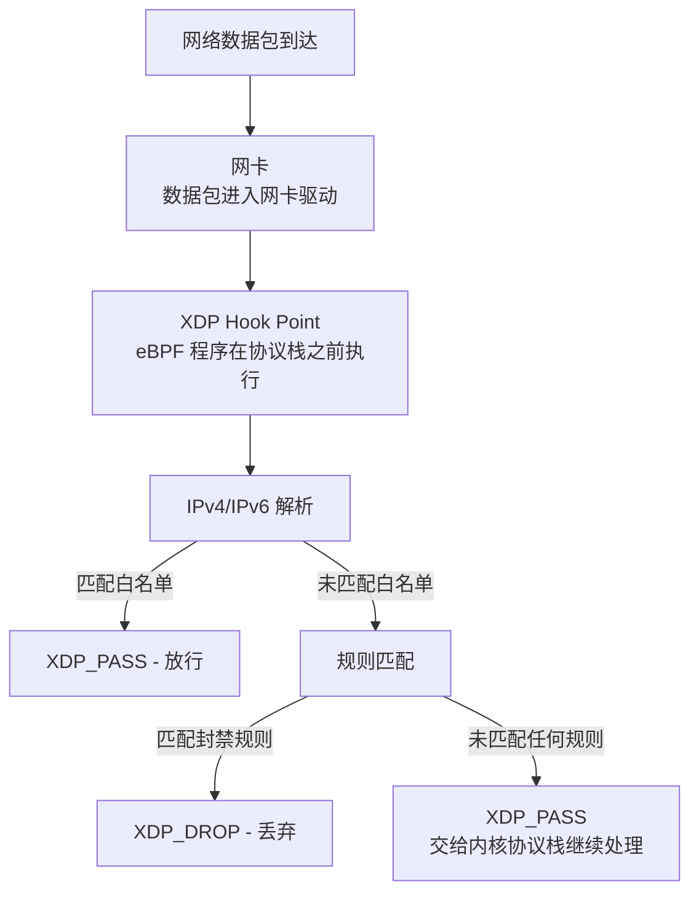
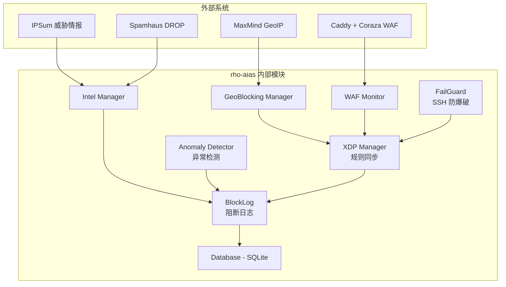

# 架构概览

本文档详细描述 rho-aias 的系统架构和各组件的协作方式。

## 整体架构

rho-aias 采用分层架构设计，主要分为三个核心层：



## 数据流



## 核心组件

### eBPF XDP 程序（内核态）

负责实际的数据包过滤，运行在内核空间：

- **包解析器**：解析 Ethernet/IP/TCP/UDP/ICMP 头部
- **规则匹配器**：基于 eBPF Map 存储的规则进行精确匹配和 CIDR 匹配
- **白名单**：优先检查白名单，确保受信流量不被拦截
- **统计计数器**：记录通过和丢弃的数据包数量
- **异常检测采样**：按配置的采样率上报包信息

### eBPF Manager（用户态）

负责用户态和内核态之间的通信：

- **规则同步器**：将用户态的规则变更同步到 eBPF Map
- **状态收集器**：从 eBPF Map 读取统计信息和运行状态
- **程序加载器**：编译和加载 eBPF 程序到内核
- **事件监听器**：接收内核上报的阻断事件和异常检测事件

### 规则引擎

管理所有防火墙规则的完整生命周期：

- 规则的 CRUD 操作
- 多源规则聚合（手动、威胁情报、WAF、异常检测、SSH 防爆破）
- 规则冲突检测和位掩码管理
- 规则过期清理

### 认证授权

基于 Casbin RBAC 的细粒度权限控制：

- **JWT 认证**：用户登录获取 Token
- **API Key**：服务间调用的简化认证
- **验证码**：防暴力破解
- **RBAC**：基于角色的访问控制
- **SSH 防爆破**：监控 SSH 认证日志，自动封禁暴力破解 IP

---

## eBPF Map 结构

| Map 名称 | 类型 | Key | Value | 用途 |
|---------|------|-----|-------|------|
| `block_ips` | `BPF_MAP_TYPE_HASH` | IP 地址 | SourceMask + Expiry | 封禁 IP 列表 |
| `block_cidrs` | `BPF_MAP_TYPE_LPM_TRIE` | CIDR 前缀 | SourceMask | 封禁 CIDR 列表 |
| `allow_ips` | `BPF_MAP_TYPE_HASH` | IP 地址 | - | 白名单 IP 列表 |
| `allow_cidrs` | `BPF_MAP_TYPE_LPM_TRIE` | CIDR 前缀 | - | 白名单 CIDR 列表 |
| `stats` | `BPF_MAP_TYPE_PERCPU_ARRAY` | 索引 | 计数器 | 包计数统计 |
| `config` | `BPF_MAP_TYPE_ARRAY` | 索引 | 配置值 | 运行时配置（含 GeoBlocking） |
| `anomaly_config` | `BPF_MAP_TYPE_ARRAY` | 索引 | 配置值 | 异常检测采样配置 |

---

## 模块交互



---

## 数据持久化

```
./data/
├── auth.db              # 认证数据库（用户、API Key、审计日志、封禁记录）
├── intel/               # 威胁情报缓存
│   ├── ipsum.json
│   └── spamhaus.json
├── geo/                 # GeoIP 缓存
│   ├── maxmind.json
│   └── GeoLite2-Country.mmdb
├── manual/              # 手动规则缓存
│   ├── rules.json       # 黑名单规则
│   └── whitelist.json   # 白名单规则
├── waf_offset.json      # WAF 日志偏移量持久化
└── failguard_offset.json # FailGuard 日志偏移量持久化

./logs/
├── rho-aias.log         # 主日志
└── blocklog/            # 阻断日志
    ├── 2026-03-28_10.jsonl
    └── 2026-03-28_11.jsonl
```

---

## 性能特性

### XDP 优势

| 特性 | 说明 |
|------|------|
| 零拷贝 | 数据包无需从内核拷贝到用户态 |
| 早期过滤 | 在协议栈之前丢弃，节省 CPU |
| 批量处理 | 支持批量数据包处理 |
| 卸载能力 | 部分网卡支持硬件卸载 |

### 性能指标

- **处理延迟**：亚微秒级
- **吞吐量**：单核 10M+ PPS
- **内存占用**：规则越多，Map 占用越大
- **CPU 开销**：取决于规则数量和流量

---

## 安全考虑

### 最小权限

```yaml
cap_drop:
  - ALL
cap_add:
  - CAP_BPF      # 加载 eBPF 程序
  - CAP_PERFMON  # 性能监控
  - CAP_NET_ADMIN # 网络管理
  - CAP_NET_RAW   # 原始套接字
```

### 资源隔离

- WAF 日志只读挂载
- 数据目录独立管理
- 日志自动轮转

### 认证保护

- JWT Token 有效期限制
- 验证码防暴力破解
- API Key 权限细粒度控制
- 审计日志记录所有操作
