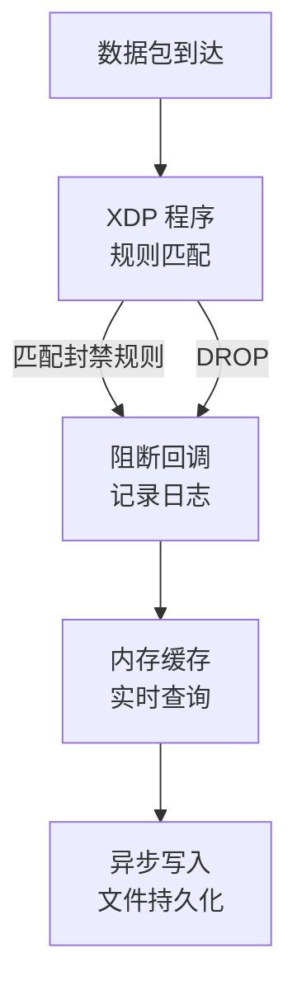

# 阻断日志

rho-aias 内置阻断日志系统，实时记录 XDP 层拦截的数据包信息，支持持久化存储和统计分析。

## 概述



## 配置

```yaml
blocklog:
  enabled: true                 # 启用文件持久化
  log_dir: "./logs/blocklog"    # 日志目录
  memory_cache_size: 10000      # 内存缓存大小
  buffer_size: 1000             # 异步写入缓冲区
  flush_interval: 5             # 刷盘间隔（秒）
```

### 参数说明

| 参数 | 说明 | 默认值 |
|------|------|--------|
| `enabled` | 是否启用文件持久化 | `true` |
| `log_dir` | 日志文件目录 | `./logs/blocklog` |
| `memory_cache_size` | 内存缓存大小，用于实时查询 | `10000` |
| `buffer_size` | 异步写入缓冲区大小 | `1000` |
| `flush_interval` | 缓冲区刷盘间隔（秒） | `5` |

---

## 日志格式

日志文件按小时分割，命名格式：`YYYY-MM-DD_HH.jsonl`

### 记录字段

```json
{
  "src_ip": "192.168.1.100",
  "dst_ip": "10.0.0.1",
  "match_type": "ip",
  "rule_source": "manual",
  "country_code": "US",
  "packet_size": 64,
  "timestamp": "2026-03-28T10:30:45.123Z"
}
```

| 字段 | 类型 | 说明 |
|------|------|------|
| `src_ip` | string | 源 IP 地址 |
| `dst_ip` | string | 目标 IP 地址 |
| `match_type` | string | 匹配类型：`ip`、`cidr` |
| `rule_source` | string | 规则来源（见下表） |
| `country_code` | string | 源 IP 所属国家代码 |
| `packet_size` | int | 数据包大小（字节） |
| `timestamp` | string | 时间戳（RFC3339） |

### 规则来源

| rule_source | 说明 | 位掩码 |
|--------------|------|--------|
| `manual` | 手动添加的规则 | `0x01` |
| `intel` | 威胁情报（IPSum/Spamhaus） | `0x02` |
| `geo` | 地域封禁 | `0x04` |
| `waf` | WAF 联动自动封禁 | `0x08` |
| `anomaly` | 异常检测自动封禁 | `0x10` |

---

## API 接口

### 查询阻断记录

```bash
GET /api/blocklog/records
```

查询参数：

| 参数 | 类型 | 说明 |
|------|------|------|
| `start` | string | 开始时间（RFC3339） |
| `end` | string | 结束时间（RFC3339） |
| `src_ip` | string | 按源 IP 过滤 |
| `limit` | int | 返回条数限制（默认 100） |

示例：

```bash
curl -H "Authorization: Bearer <token>" \
  "http://localhost:8081/api/blocklog/records?start=2026-03-28T00:00:00Z&limit=50"
```

响应：

```json
{
  "records": [
    {
      "src_ip": "192.168.1.100",
      "dst_ip": "10.0.0.1",
      "match_type": "ip",
      "rule_source": "manual",
      "country_code": "US",
      "packet_size": 64,
      "timestamp": "2026-03-28T10:30:45.123Z"
    }
  ],
  "total": 150
}
```

### 获取阻断统计

```bash
GET /api/blocklog/stats
```

响应：

```json
{
  "total_blocked": 100000,
  "by_source": {
    "manual": 500,
    "intel": 50000,
    "geo": 30000,
    "waf": 15000,
    "anomaly": 4500
  },
  "by_country": {
    "US": 35000,
    "CN": 5000,
    "RU": 25000,
    "Unknown": 10000
  },
  "top_blocked_ips": [
    {"ip": "192.168.1.100", "count": 5000},
    {"ip": "10.0.0.50", "count": 3000}
  ]
}
```

### 获取被阻断的 IP 列表

```bash
GET /api/blocklog/blocked-ips
```

查询参数：

| 参数 | 类型 | 说明 |
|------|------|------|
| `limit` | int | 返回条数限制 |

响应：

```json
{
  "ips": [
    {"ip": "192.168.1.100", "count": 5000, "last_seen": "2026-03-28T10:00:00Z"},
    {"ip": "10.0.0.50", "count": 3000, "last_seen": "2026-03-28T09:55:00Z"}
  ],
  "total": 500
}
```

### 获取被阻断的国家列表

```bash
GET /api/blocklog/blocked-countries
```

响应：

```json
{
  "countries": [
    {"country_code": "US", "count": 35000},
    {"country_code": "RU", "count": 25000},
    {"country_code": "CN", "count": 5000}
  ],
  "total": 3
}
```

### 清除阻断记录

```bash
DELETE /api/blocklog/records
```

::: warning 注意
此操作需要 `blocklog:clear` 权限，会清除内存缓存中的记录（不影响已持久化的文件）。
:::

---

## 性能优化

### 内存缓存

- 阻断记录首先写入内存环形缓存
- 支持快速实时查询，无需读取文件
- 缓存满后自动覆盖旧记录

### 异步写入

- 使用缓冲区批量写入，减少磁盘 I/O
- 可配置刷盘间隔，平衡性能和数据安全
- 服务关闭时自动刷盘，避免数据丢失

### 文件分割

- 按小时分割日志文件，便于管理
- 过期日志可通过 `log.max_age_days` 自动清理

---

## 最佳实践

### 1. 监控阻断趋势

定期查看统计数据，识别攻击模式：

```bash
# 每小时查看阻断统计
curl -H "Authorization: Bearer <token>" \
  http://localhost:8081/api/blocklog/stats
```

### 2. 结合威胁情报

观察 `by_source` 分布，评估各数据源效果：

- 威胁情报命中多 → 情报源有效
- WAF 命中多 → 应用层攻击频繁
- 异常检测命中多 → DDoS 攻击

### 3. 分析攻击来源

查看 `by_country` 和 `top_blocked_ips`：

- 特定国家攻击多 → 考虑地域封禁
- 单一 IP 攻击多 → 手动封禁或调整阈值

### 4. 日志归档

生产环境建议：

```bash
# 定期归档旧日志
find ./logs/blocklog -name "*.jsonl" -mtime +30 -exec gzip {} \;

# 或使用日志收集系统（ELK、Loki）统一管理
```

---

## 日志文件示例

`./logs/blocklog/2026-03-28_10.jsonl`:

```json
{"src_ip":"192.168.1.100","dst_ip":"10.0.0.1","match_type":"ip","rule_source":"manual","country_code":"US","packet_size":64,"timestamp":"2026-03-28T10:00:01.123Z"}
{"src_ip":"10.50.0.25","dst_ip":"10.0.0.1","match_type":"cidr","rule_source":"intel","country_code":"RU","packet_size":128,"timestamp":"2026-03-28T10:00:01.456Z"}
{"src_ip":"172.16.0.5","dst_ip":"10.0.0.1","match_type":"ip","rule_source":"geo","country_code":"KP","packet_size":64,"timestamp":"2026-03-28T10:00:02.789Z"}
```
