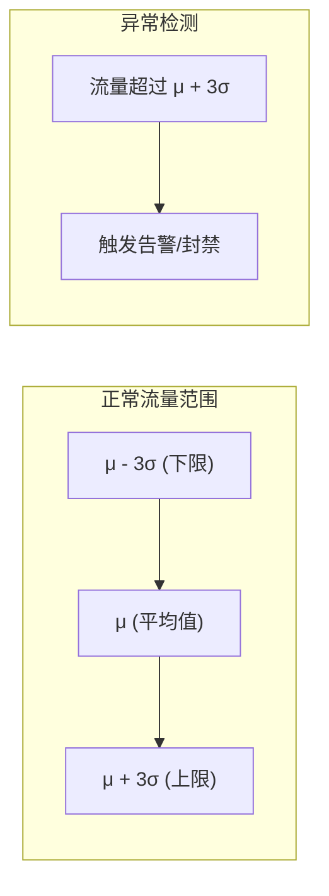
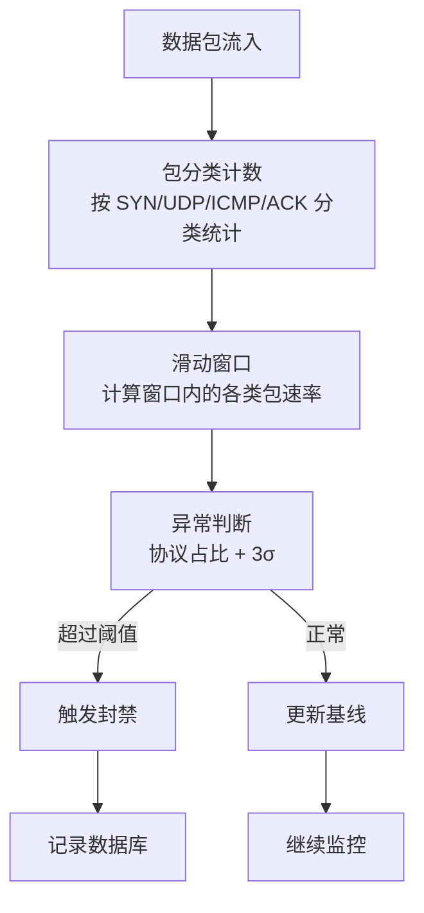

# 异常检测

rho-aias 内置了基于统计基线的异常流量检测系统，能够自动识别 DDoS 攻击并触发响应措施。

## 检测原理

rho-aias 使用 **3σ（三倍标准差）** 统计方法建立流量基线，实时监控网络流量偏离正常范围的情况：



::: tip 3σ 原则说明
- **μ（均值）**：历史时间窗口内的平均流量
- **σ（标准差）**：流量的波动程度
- 约 99.7% 的正常数据落在 μ ± 3σ 范围内
- 超出此范围的流量判定为异常
:::

## 支持的攻击类型

| 攻击类型 | 检测方式 | 说明 |
|---------|---------|------|
| SYN Flood | SYN 包占比 | 大量半开连接耗尽服务器资源 |
| UDP Flood | UDP 包占比 | 大量 UDP 包淹没带宽 |
| ICMP Flood | ICMP 包占比 | 利用 ICMP 协议进行流量攻击 |
| ACK Flood | ACK 包占比 | 发送大量 ACK 包干扰连接 |

## 配置

在 `config.yml` 中配置异常检测：

```yaml
anomaly_detection:
  enabled: true                    # 总开关

  # 采样配置
  sample_rate: 1                    # 采样率（1=100%，100=1%）

  # 检测配置
  check_interval: 1                 # 检测间隔（秒）
  min_packets: 200                  # 全局最小包数门槛（单 IP 每秒 <200 包直接跳过攻击检测）
  cleanup_interval: 300             # 清理过期数据间隔（秒）

  # 封禁配置
  block_duration: 60                # 临时封禁时长（秒）

  # 端口过滤配置（仅对指定端口进行异常检测，同时应用于 TCP/UDP，为空则检测所有端口）
  ports:
    - 80
    - 443
    - 8080
    - 53

  # 3σ 基线配置（兜底检测：协议比例正常但流量异常大的场景）
  # 使用 Welford 在线算法更新均值/方差，阈值 = μ + k × σ
  baseline:
    min_sample_count: 60            # 最小学习样本数（60 秒），不足时仅学习不检测
    sigma_multiplier: 4.0           # σ 倍数，4σ 覆盖 99.993%，平衡灵敏度与误报
    min_threshold: 1000             # 最小 PPS 阈值，PPS <1000 的 IP 豁免基线检测
    max_age: 3600                   # 基线最大有效期（秒），过期自动重置以适应流量变化

  # 攻击类型检测
  # 封禁条件 = 全局 min_packets 通过 + 类型 min_packets 通过 + ratio_threshold 通过
  attacks:
    syn_flood:
      enabled: true
      ratio_threshold: 0.5          # SYN/TCP > 50% 才触发（正常流量远低于此值）
      min_packets: 200              # TCP 包 ≥200 才检测
      block_duration: 60            # 封禁时长（秒）
    udp_flood:
      enabled: true
      ratio_threshold: 0.8          # UDP/总包 > 80% 才触发
      min_packets: 200              # UDP 包 ≥200 才检测
      block_duration: 60
    icmp_flood:
      enabled: true
      ratio_threshold: 0.5          # ICMP/总包 > 50% 才触发
      min_packets: 50               # ICMP 包 ≥50 才检测（特征明显，可适当放宽）
      block_duration: 60
    ack_flood:
      enabled: true
      ratio_threshold: 0.9          # ACK/TCP > 90% 才触发（正常下载通常 <85%）
      min_packets: 500              # TCP 包 ≥500 才检测（主要误触来源，必须抬高）
      block_duration: 60
```

### 参数说明

| 参数 | 说明 | 默认值 |
|------|------|--------|
| `sample_rate` | 采样率，1 表示 100% 采样 | `1` |
| `check_interval` | 检测间隔（秒） | `1` |
| `min_packets` | 全局最小包数门槛（单 IP 每秒 <200 包直接跳过攻击检测） | `200` |
| `cleanup_interval` | 清理间隔（秒） | `300` |
| `block_duration` | 临时封禁时长（秒） | `60` |
| `ports` | 检测端口列表（空则全部，同时应用于 TCP/UDP） | `[]` |

### 基线配置说明

| 参数 | 说明 | 默认值 |
|------|------|--------|
| `min_sample_count` | 建立基线的最小样本数（不足时仅学习不检测） | `10` |
| `sigma_multiplier` | σ 倍数，越高越宽松 | `3.0` |
| `min_threshold` | 最小 PPS 阈值，保护低流量 IP | `100` |
| `max_age` | 基线最大年龄（秒），过期后重建 | `1800` |

::: tip 推荐配置
上方的配置示例使用了生产推荐的调优值（`min_packets: 200`、`min_sample_count: 60`、`sigma_multiplier: 4.0` 等），相比代码内置默认值更适合高流量环境。请根据实际业务场景进行调整。
:::

### 攻击类型配置说明

| 参数 | 说明 |
|------|------|
| `enabled` | 是否启用此类型检测 |
| `ratio_threshold` | 协议包占比阈值（0.0-1.0） |
| `min_packets` | 触发检测的最小包数 |
| `block_duration` | 封禁时长（秒） |

## 工作流程



## 检测逻辑

### 协议占比检测

对于每种攻击类型，系统计算该协议包占总包数的比例：

```
SYN 占比 = SYN 包数 / 总 TCP 包数
UDP 占比 = UDP 包数 / 总包数
ICMP 占比 = ICMP 包数 / 总包数
ACK 占比 = ACK 包数 / 总 TCP 包数
```

当占比超过 `ratio_threshold` 时触发告警。

### 3σ 基线检测

系统为每个源 IP 维护流量基线：

1. 记录历史流量样本
2. 计算均值 μ 和标准差 σ
3. 当实时流量 > μ + kσ 时判定异常

参数调优：
- `sigma_multiplier = 3`：约 99.7% 正常流量在阈值内
- 增大可减少误报，但可能漏报
- 减小可提高检测灵敏度，但增加误报

## 封禁管理

### 查看封禁记录

```bash
curl -H "Authorization: Bearer <token>" \
  "http://localhost:8081/api/ban-records?source=anomaly"
```

响应示例：

```json
{
  "records": [
    {
      "id": 1,
      "ip": "192.168.1.100",
      "source": "anomaly",
      "reason": "SYN flood detected (ratio: 0.85, threshold: 0.5)",
      "duration": 60,
      "expired": false,
      "created_at": "2026-03-28T10:00:00Z",
      "expires_at": "2026-03-28T10:01:00Z"
    }
  ],
  "total": 5
}
```

### 查看封禁统计

```bash
curl -H "Authorization: Bearer <token>" \
  http://localhost:8081/api/ban-records/stats
```

## 最佳实践

::: tip 建议
1. **先观察后开启自动封禁**：建议先运行检测系统观察基线数据，确认阈值合理后再开启
2. **合理设置阈值**：根据实际业务流量调整 `ratio_threshold`，避免误判
3. **关注端口配置**：仅对业务端口开启检测，减少误报
4. **配合 WAF 使用**：结合 WAF 联动实现 L3 + L7 双层防护
5. **启用 SSH 防爆破**：开启 [FailGuard](/guide/failguard) 保护 SSH 服务免受暴力破解
6. **定期检查封禁记录**：关注封禁记录，及时发现异常
:::

### 调参建议

#### 高流量场景

```yaml
anomaly_detection:
  min_packets: 500
  baseline:
    min_threshold: 1000
    sigma_multiplier: 3.5
```

#### 低流量场景

```yaml
anomaly_detection:
  min_packets: 20
  baseline:
    min_threshold: 50
    sigma_multiplier: 2.5
```

#### 严格模式

```yaml
anomaly_detection:
  attacks:
    syn_flood:
      ratio_threshold: 0.3
      block_duration: 300
```

#### 宽松模式

```yaml
anomaly_detection:
  attacks:
    syn_flood:
      ratio_threshold: 0.7
      block_duration: 30
```
