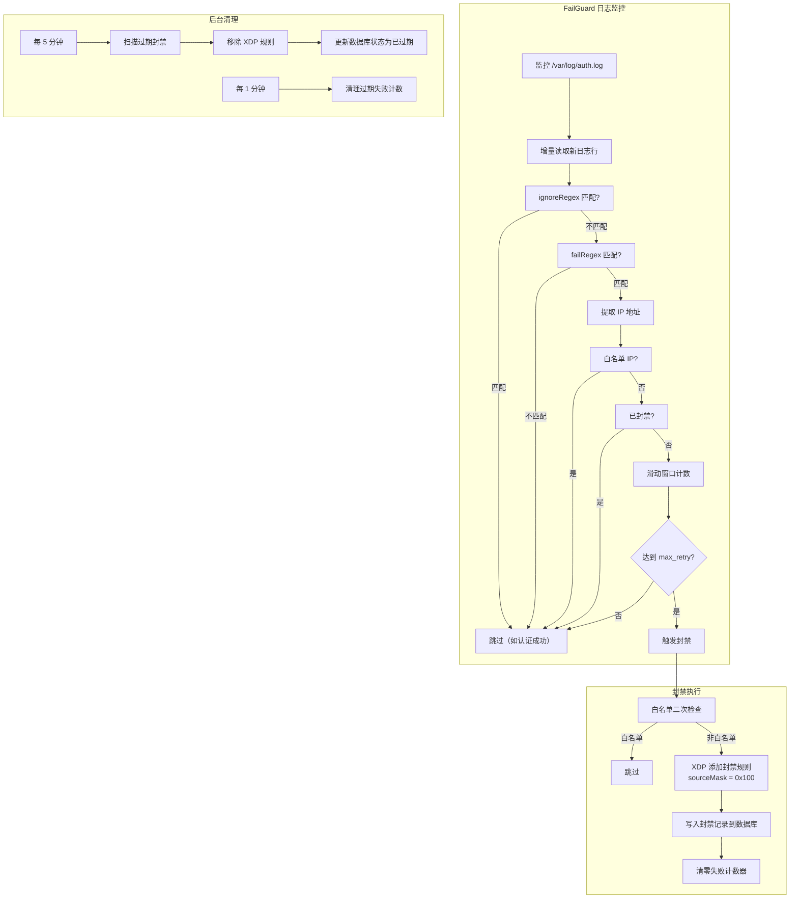

# SSH 防爆破 (FailGuard)

FailGuard 是 rho-aias 内置的 SSH 防暴力破解模块，参考 [fail2ban](https://www.fail2ban.org/) 的核心设计理念，通过监控 SSH 认证日志自动检测并封禁暴力破解来源 IP。

## 工作原理



## 检测模式

FailGuard 提供三种检测模式，对应不同的安全级别和攻击场景：

| 模式 | 说明 | 覆盖场景 | 误报风险 |
|------|------|---------|---------|
| **normal**（默认） | 仅匹配 SSH 认证失败 | 密码错误、无效用户、PAM 失败、最大尝试次数 | 低 |
| **ddos** | normal + preauth 阶段异常 | 扫描器探测、认证超时、preauth 断连 | 中 |
| **aggressive** | ddos + 协议协商失败 | 协议版本错误、密钥协商失败、banner 异常 | 较高 |

### normal 模式

内置 14 条正则规则，覆盖：

- 密码认证失败：`Failed password for ...`
- 无效用户：`Invalid user ...`
- PAM 认证失败：`pam_unix(sshd:auth): auth failure`
- 最大尝试次数：`Maximum authentication attempts exceeded`
- ROOT 登录拒绝：`ROOT LOGIN REFUSED`
- 账户锁定：`userauth_pubkey: locked account`

### ddos 模式

在 normal 基础上额外添加 6 条规则：

- 未发送识别字符串（扫描器探测）：`Did not receive identification string`
- 认证超时：`Timeout before authentication`
- 输入过大：`input_userauth_request: excessive input`
- TCP Wrapper 拒绝：`refused connect from`
- preauth 阶段断连：`Connection closed/reset ... [preauth]`

### aggressive 模式

在 ddos 基础上额外添加 7 条规则：

- 协议版本错误：`Bad protocol version identification`
- 密钥协商失败：`fatal: Unable to negotiate ... no matching key exchange`
- 加密协商失败：`fatal: Unable to negotiate ... no matching cipher`
- MAC 协商失败：`fatal: Unable to negotiate ... no matching MAC`
- banner 异常：`banner exchange: Connection from ...`

## 配置

在 `config.yml` 中配置 FailGuard：

```yaml
# SSH 防爆破配置（参考 fail2ban 核心功能）
failguard:
  enabled: true                     # 是否启用 SSH 防爆破
  log_path: /var/log/auth.log        # 监控的日志文件路径
  offset_state_file: ./data/failguard_offset.json  # 偏移量持久化文件路径
  mode: normal                       # 检测模式: normal/ddos/aggressive
  max_retry: 5                       # 触发封禁的失败次数阈值
  find_time: 600                     # 滑动窗口时长（秒，默认 10 分钟）
  ban_duration: 3600                 # 封禁时长（秒，默认 1 小时）
  ignore_ips:                        # 白名单 IP/CIDR（永不封禁）
    # - "10.0.0.0/8"
    # - "192.168.1.100"
  # fail_regex:                      # 自定义失败匹配正则（留空使用内置规则）
  #   - "Failed \\w+ for .* from <HOST>"
  # ignore_regex:                    # 自定义忽略匹配正则（留空使用内置规则）
  #   - "Accepted \\w+ for .* from <HOST>"
```

### 参数说明

| 参数 | 类型 | 默认值 | 说明 |
|------|------|--------|------|
| `enabled` | bool | false | 是否启用 FailGuard |
| `log_path` | string | `/var/log/auth.log` | SSH 认证日志文件路径 |
| `offset_state_file` | string | `./data/failguard_offset.json` | 偏移量持久化文件路径 |
| `mode` | string | `normal` | 检测模式：`normal`、`ddos`、`aggressive` |
| `max_retry` | int | `5` | 滑动窗口内触发封禁的失败次数阈值 |
| `find_time` | int | `600` | 滑动窗口时长（秒） |
| `ban_duration` | int | `3600` | 封禁时长（秒） |
| `ignore_ips` | []string | `[]` | 白名单 IP/CIDR 列表（支持单 IP 和 CIDR 格式） |
| `fail_regex` | []string | - | 自定义失败匹配正则（留空按 mode 使用内置规则） |
| `ignore_regex` | []string | - | 自定义忽略匹配正则（留空使用内置默认） |

### 自定义正则说明

正则中使用 `<HOST>` 占位符表示待提取的 IP 地址（兼容 fail2ban 语法），运行时自动替换为 IPv4 命名捕获组 `(?P<host>...)`。IP 提取优先使用命名捕获组 `host`，其次回退到第一个匹配 IP 的子组。

## 日志轮转支持

FailGuard 通过文件的 **inode** 检测日志轮转：

1. 每次读取日志时记录当前文件的 inode 和偏移量
2. 下次读取时比较 inode：如果 inode 变化，说明日志已轮转，从头读取新文件
3. 如果文件大小小于上次偏移量，也视为轮转，从头读取

偏移量和 inode 通过 `offset_state_file` 持久化，确保程序重启后能从正确位置继续读取。

## 封禁生命周期

```
SSH 失败认证 → 达到阈值 → XDP 内核层封禁（sourceMask 0x100）
                                    ↓
                    实际封禁时长 = ban_duration + 最多 5 分钟清理延迟
                                    ↓
                    cleanupExpiredBans() 每 5 分钟扫描一次
                                    ↓
                    过期 IP 移除 XDP 规则 + 更新数据库状态
```

::: warning 封禁延迟
`cleanupExpiredBans()` 使用固定 **5 分钟**清理间隔。封禁到期后，XDP 规则不会立即移除，需等待下一个清理周期。建议 `ban_duration` 设为 **300 秒（5 分钟）或更长**，使清理延迟占比合理。
:::

## 与其他模块的协作

### 白名单集成

FailGuard 集成了手动规则模块的白名单检查器，在封禁前进行二次检查：

- 日志处理阶段：`ignore_ips` 配置的白名单跳过计数
- 封禁执行阶段：调用全局白名单检查器（`WhitelistChecker`），避免封禁白名单 IP

### 数据库集成

封禁记录自动写入 SQLite 数据库（`ban_records` 表），可通过 API 查询：

```bash
# 查看 FailGuard 封禁记录
curl -H "Authorization: Bearer <token>" \
  "http://localhost:8081/api/ban-records?source=failguard"
```

### 位掩码

FailGuard 使用专用位掩码 `0x100`（Bit 8）标记来源，不与其他模块冲突：

```
source_mask = 0x100 (仅 FailGuard)
```

解除封禁时仅移除 FailGuard 位，如果该 IP 还被其他来源封禁则保留规则。

## Docker 部署

在 Docker 环境中使用 FailGuard 时，需将主机的 SSH 认证日志挂载到容器内：

```yaml
# docker-compose.yml
services:
  rho-aias:
    volumes:
      - /var/log/auth.log:/var/log/auth.log:ro
```

::: tip 日志权限
确保 rho-aias 进程对日志文件有读取权限。在 Docker 中使用 `:ro` 只读挂载即可满足。
:::

## 最佳实践

### 1. 选择合适的检测模式

| 场景 | 推荐模式 | 说明 |
|------|---------|------|
| 面向公网的 SSH 服务 | `normal` | 覆盖常见暴力破解，误报极低 |
| 遭遇端口扫描 | `ddos` | 检测 preauth 阶段异常行为 |
| 高安全要求 | `aggressive` | 最严格检测，注意监控误报 |

### 2. 调整阈值

根据实际业务需求调整参数：

```yaml
failguard:
  max_retry: 3        # 更激进的封禁策略
  find_time: 300      # 缩短窗口到 5 分钟
  ban_duration: 86400 # 封禁 24 小时
```

### 3. 配合白名单使用

确保管理 IP 和可信网段不会被误封：

```yaml
failguard:
  ignore_ips:
    - "10.0.0.0/8"
    - "172.16.0.0/12"
    - "192.168.0.0/16"
```

### 4. 配合其他模块联动

FailGuard 的 XDP 封禁规则与其他模块共存，位掩码机制确保多源规则不会冲突。可以同时启用 WAF 联动、异常检测等模块实现多层防护。

### 5. 监控封禁记录

定期检查封禁记录，及时发现异常：

```bash
# 查看活跃的 FailGuard 封禁
curl -s "http://localhost:8081/api/ban-records?source=failguard" | jq '.records[] | select(.expired == false)'
```
