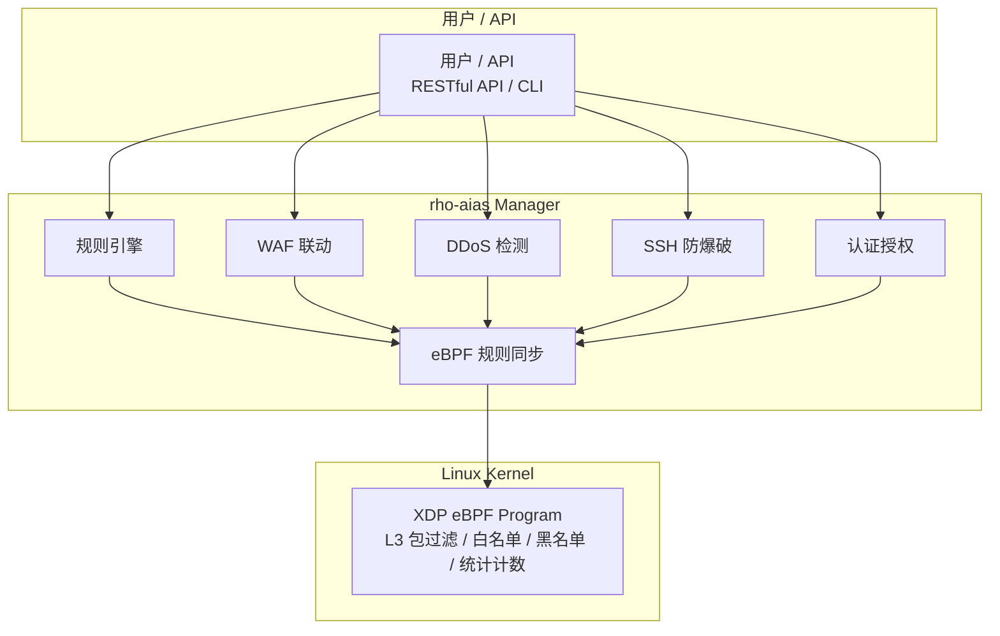

# 简介

## 什么是 rho-aias？

rho-aias 是一个基于 **eBPF** 和 **XDP（eXpress Data Path）** 技术的高性能网络防火墙系统。它在网络驱动层（L3）拦截和过滤数据包，相比传统的 netfilter/iptables 方案具有显著的性能优势。

## 核心优势

::: info 为什么选择 XDP？
XDP（eXpress Data Path）是 Linux 内核提供的高性能数据包处理框架，在网络驱动程序收到数据包后、进入网络协议栈之前执行 eBPF 程序，可以实现：
- **极低延迟**：数据包在驱动层即被处理，避免进入内核协议栈
- **高吞吐量**：单核即可处理数百万 PPS（Packet Per Second）
- **灵活可编程**：eBPF 程序可动态加载/卸载，无需重启
:::

### 性能对比

| 方案 | 处理位置 | 性能 | 可编程性 |
|------|---------|------|---------|
| XDP | 网卡驱动层 | ⭐⭐⭐ 极高 | eBPF 灵活 |
| iptables | Netfilter 钩子 | ⭐⭐ 中等 | 规则配置 |
| nftables | Netfilter 钩子 | ⭐⭐ 中等 | 规则配置 |
| 用户态防火墙 | 应用层 | ⭐ 较低 | 完全灵活 |

## 功能概览

| 功能模块 | 说明 |
|---------|------|
| XDP 包过滤 | eBPF 内核程序，L3 层精确匹配和 CIDR 范围匹配 |
| 多源规则管理 | 手动规则 + 威胁情报 + GeoIP + WAF 联动 + 异常检测 + SSH 防爆破 |
| WAF 联动 | 监控 Coraza WAF 日志，自动封禁恶意 IP |
| DDoS 检测 | 3σ 统计基线 + 攻击类型识别 + 自动响应 |
| SSH 防爆破 | 监控 SSH 认证日志，滑动窗口计数 + 自动封禁（参考 fail2ban） |
| 地域封禁 | MaxMind GeoIP 数据库，支持白名单/黑名单模式 |
| 阻断日志 | 实时记录拦截事件，支持统计分析和持久化 |
| 认证授权 | JWT/API Key/Casbin RBAC，细粒度权限控制 |

## 技术架构

## 规则来源

rho-aias 支持多种规则来源，通过位掩码实现多源聚合：

| 来源 | 说明 | 位掩码 |
|------|------|--------|
| IPSum | 第三方威胁情报源（~23万条规则） | `0x01` |
| Spamhaus DROP | 国际知名垃圾邮件黑名单 | `0x02` |
| 手动规则 | 通过 API 手动添加的 IP/CIDR 规则 | `0x04` |
| WAF 自动封禁 | 监控 WAF 审计日志自动封禁 IP | `0x08` |
| DDoS 防护 | 异常流量检测自动封禁 | `0x10` |
| 频率限制 | Rate Limit 日志触发封禁 | `0x20` |
| 异常检测 | 3σ 基线 + 攻击类型检测封禁 | `0x40` |
| SSH 防爆破 | FailGuard SSH 暴力破解防护 | `0x80` |

::: info 白名单说明
IP 白名单已从位掩码机制中分离，不再占用位掩码位。白名单使用独立的 `allow_ips`/`allow_cidrs` eBPF Map 存储，具有最高优先级，直接放行。
:::

当同一 IP 被多个来源标记时，位掩码会合并；删除时会检查是否还有其他来源，避免误删。

## 适用场景

- **服务器防护**：保护 Web 服务器、数据库服务器免受恶意流量攻击
- **DDoS 防御**：快速识别和拦截分布式拒绝服务攻击
- **WAF 协同**：与 Web 应用防火墙联动，实现网络层 + 应用层双重防护
- **威胁情报**：自动订阅和管理威胁情报源，实时更新防护规则
- **地域封禁**：按国家/地区限制访问，应对地域性攻击

## 系统要求

| 项目 | 要求 |
|------|------|
| 操作系统 | Linux Kernel 5.8+（推荐 6.1+） |
| 权限 | root 或 CAP_BPF、CAP_PERFMON、CAP_NET_ADMIN、CAP_NET_RAW |
| 硬件 | 支持 XDP 的网卡 |
| Go | 1.25+（仅源码编译需要） |

::: tip 内核版本说明
- Kernel 5.8+：基础 XDP 支持
- Kernel 5.10+：更好的 eBPF 特性支持
- Kernel 6.1+：推荐的稳定版本
:::

## 开源协议

rho-aias 采用开源协议发布，欢迎贡献代码和反馈建议。

- 📦 代码仓库：[CNB rho-aias](https://cnb.cool/MakeCNBGreatAgain/rho-aias.git)
