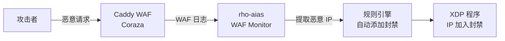

# WAF 集成

rho-aias 可以与 Caddy + Coraza WAF 联动，通过监控 WAF 日志自动识别恶意 IP 并将其加入防火墙封禁列表。

## 工作原理



## 前置条件

- 已部署 Caddy Web 服务器
- 已安装 Coraza WAF 插件
- Caddy 配置了审计日志输出

## 配置 WAF 联动

### 1. Caddy 配置

确保 Caddy 配置了审计日志：

```
{
    admin off
    log {
        output file /logs/waf_audit.log {
            roll_size 100mb
            roll_keep 5
        }
        format json
    }
}

example.com {
    encode gzip

    coraza_waf {
        load_owasp_crs
    }

    # Rate Limit 配置
    rate_limit {
        zone dynamic {
            key {remote_host}
            events 100
            window 1m
        }
    }

    reverse_proxy localhost:8080
}
```

### 2. rho-aias 配置

在 `config.yml` 中启用 WAF 联动：

```yaml
waf:
  enabled: true
  waf_log_path: /caddy-logs/waf_audit.log      # WAF 审计日志
  rate_limit_log_path: /caddy-logs/rate_limit.log  # Rate Limit 日志
  ban_duration: 3600                            # 封禁时长（秒）
  offset_state_file: ./data/waf_offset.json     # 偏移量持久化文件路径
```

### 3. Docker Compose 配置

```yaml
services:
  caddy:
    image: docker.cnb.cool/makecnbgreatagain/rho-aias/rho-aias-caddy:latest
    container_name: caddy
    network_mode: host
    cap_drop:
      - ALL
    cap_add:
      - NET_BIND_SERVICE
    security_opt:
      - no-new-privileges:true
    volumes:
      - ./caddy/Caddyfile:/etc/caddy/Caddyfile:ro
      - ./caddy/config:/root/.config
      - ./caddy/data:/root/.local/share/caddy
      - ./logs/caddy:/logs

  rho-aias:
    image: docker.cnb.cool/makecnbgreatagain/rho-aias/rho-aias:latest
    container_name: rho-aias
    network_mode: host
    cap_drop:
      - ALL
    cap_add:
      - CAP_BPF
      - CAP_PERFMON
      - CAP_NET_ADMIN
      - CAP_NET_RAW
    volumes:
      - ./config.yml:/app/config/config.yml:ro
      - ./logs/rho-aias:/app/logs
      - ./data:/app/data
      - ./logs/caddy:/caddy-logs:ro    # 共享 WAF 日志（只读）
    command: ["--config", "/app/config/config.yml"]
```

---

## 参数说明

| 参数 | 说明 | 默认值 |
|------|------|--------|
| `enabled` | 是否启用 WAF 联动 | `false` |
| `waf_log_path` | WAF 审计日志路径 | `/logs/waf_audit.log` |
| `rate_limit_log_path` | Rate Limit 日志路径 | `/logs/rate_limit.log` |
| `ban_duration` | 封禁时长（秒） | `3600` |
| `offset_state_file` | 偏移量持久化文件路径 | `./data/waf_offset.json` |

---

## IP 封禁清理机制

WAF 模块通过监控 Caddy + Coraza WAF 日志和 Rate Limit 日志，自动触发 IP 封禁。

### 封禁生命周期

```
日志触发 → banIP() 添加 XDP 封禁规则 → 封禁记录写入内存（带过期时间）
                                                    ↓
                                        cleanupExpiredBans() 每隔 5 分钟扫描
                                                    ↓
                                        过期 IP 移除 XDP 规则 + 清除内存记录
```

::: warning 重要：清理间隔为固定 5 分钟
`cleanupExpiredBans()` 使用硬编码的 **5 分钟清理间隔**。当封禁到期后，XDP 规则不会立即移除，而是等待下一个清理周期才执行移除。

这意味着实际封禁时长 = `ban_duration` + 最多 5 分钟的清理延迟。
:::

### 配置建议

| ban_duration | 实际封禁时长范围 | 建议 |
|--------------|------------------|------|
| 30s | 30s ~ 5m30s | ❌ 不推荐，XDP 规则滞留过久 |
| 60s | 60s ~ 6m | ⚠️ 清理延迟占比过大 |
| 300s（5 分钟） | 5m ~ 10m | ✅ 可接受 |
| 600s（10 分钟） | 10m ~ 15m | ✅ 推荐 |
| 3600s（1 小时，默认） | 1h ~ 1h5m | ✅ 推荐 |

**最佳实践**：建议将 `ban_duration` 设置为 **300 秒（5 分钟）或更长**，使清理延迟在整体封禁时长中的占比合理。

---

## 工作流程

1. **日志监控**：rho-aias 实时监控 WAF 审计日志和 Rate Limit 日志
2. **恶意识别**：解析日志中的恶意 IP
3. **自动封禁**：将 IP 通过 eBPF 程序加入封禁列表
4. **持久化记录**：封禁记录写入数据库
5. **自动清理**：封禁到期后自动从列表中移除

### 触发条件

#### WAF 审计日志

- Coraza 检测到攻击行为（SQL Injection、XSS、命令注入等）
- 日志中包含规则 ID 和攻击类型

#### Rate Limit 日志

- 请求频率超过配置的阈值
- 触发 Caddy rate_limit 模块

---

## 封禁记录管理

### 查看封禁记录

```bash
curl -H "Authorization: Bearer <token>" \
  http://localhost:8081/api/ban-records?source=waf
```

响应：

```json
{
  "records": [
    {
      "id": 1,
      "ip": "192.168.1.100",
      "source": "waf",
      "reason": "SQL Injection attempt (rule 942100)",
      "duration": 3600,
      "expired": false,
      "created_at": "2026-03-28T10:00:00Z",
      "expires_at": "2026-03-28T11:00:00Z"
    }
  ],
  "total": 50
}
```

### 查看封禁统计

```bash
curl -H "Authorization: Bearer <token>" \
  http://localhost:8081/api/ban-records/stats
```

---

## 安全说明

### 最小权限部署

rho-aias 使用最小权限能力，不使用 privileged 模式：

```yaml
cap_drop:
  - ALL
cap_add:
  - CAP_BPF
  - CAP_PERFMON
  - CAP_NET_ADMIN
  - CAP_NET_RAW
```

### 日志隔离

WAF 日志通过只读卷共享给 rho-aias：

```yaml
volumes:
  - ./logs/caddy:/caddy-logs:ro
```

---

## 注意事项

- 确保 rho-aias 进程对日志文件有读取权限
- 日志文件格式需要是 JSON 格式
- WAF 联动产生的规则会自动标记来源为 `waf`
- 封禁时长建议设置为 5 分钟以上
- 定期检查封禁记录，避免误封正常用户
